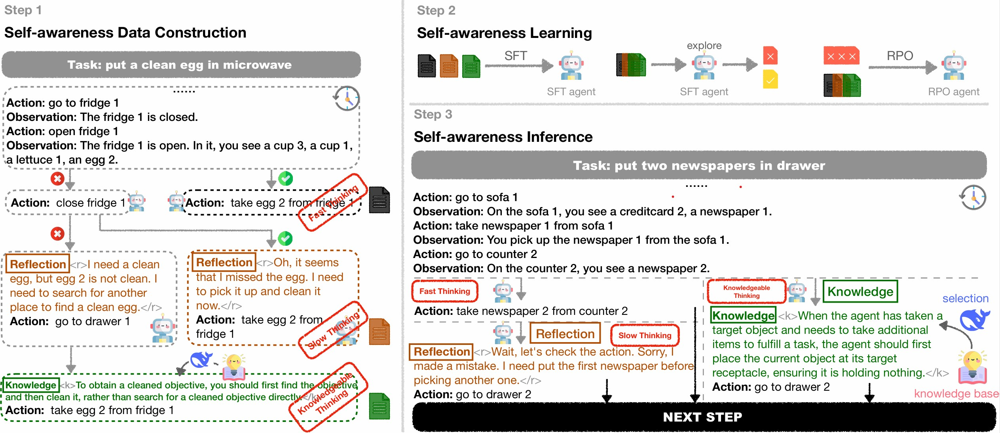

<h1 align="center"> KnowSelf </h1>
<h3 align="center"> Agentic Knowledgeable Self-awareness </h3>

<!-- <p align="center">
  <a href="https://arxiv.org/abs/2410.07869">📄arXiv</a> •
  <a href="https://huggingface.co/papers/2410.07869">🤗HFPaper</a> •
  <a href="https://www.zjukg.org/project/WorFBench/">🌐Web</a> •
  <a href="https://huggingface.co/collections/zjunlp/worfbench-66fc28b8ac1c8e2672192ea1">📊Dataset</a> •
  <a href="https://notebooklm.google.com/notebook/a4c13fd7-29da-462c-a47e-69a26c0d326e/audio">🎧NotebookLM Audio</a>
</p> -->

[](https://github.com/zjunlp/KnowSelf) 
[](https://opensource.org/licenses/MIT)
<!--  -->

## Table of Contents

- [🌻Acknowledgement](#acknowledgement)
- [🌟Overview](#overview)
- [🔧Installation](#installation)
- [🚀QuickStart](#quickstart)
- [📚Knowledge-System-Construction](#knowledge-system-construction)
- [📝Training-Data-Construction](#training-data-construction)
- [📉Training](#training)
- [🧐Evaluation](#evaluation)
<!-- - [🚩Citation](#citation) -->
<!-- - 🎉[Contributors](#🎉contributors) -->

---

## 🌻Acknowledgement

Our code of the training module is referenced from [self-rag](https://github.com/AkariAsai/self-rag), while the code of the inference module is implemented based on [ETO](https://github.com/Yifan-Song793/ETO) and [IPR](https://github.com/WeiminXiong/IPR). And our code of the knowledge generation and consolidation module is referenced and adapted from [AutoManual](https://github.com/minghchen/automanual). The templator module of models is referenced from [OneGen](https://github.com/zjunlp/OneGen). Various baseline codes are sourced from [ReAct](https://github.com/ysymyth/ReAct), [Reflexion](https://github.com/noahshinn/reflexion), [ExpeL](https://github.com/LeapLabTHU/ExpeL), [ETO](https://github.com/Yifan-Song793/ETO), [KnowAgent](https://github.com/zjunlp/KnowAgent), [WKM](https://github.com/zjunlp/WKM). We use [LLaMA-Factory](https://github.com/hiyouga/LLaMA-Factory) to deploy our models. Thanks for their great contributions!




## 🌟Overview

Large Language Models (LLMs) have achieved considerable performance across various agentic planning tasks. However, traditional approaches adopt a ''flood irrigation'' methodology that indiscriminately injects gold trajectories, external feedback, and domain knowledge into agent models. This practice overlooks the fundamental human cognitive principle of self-awareness - the ability to dynamically assess situational demands and strategically employ resources during decision-making. We propose **agentic knowledgeable self-awareness** to address this gap, a novel paradigm enabling LLM-based agents to autonomously regulate knowledge utilization. 

Specifically, we propose ***KnowSelf***, a data-centric approach that applies agents with ***know***ledgeable ***self***-awareness like humans. Concretely, we devise a heuristic situation judgement criterion to mark special tokens on the agent's self-explored trajectories for collecting training data. Through a two-stage training process, the agent model can switch between different situations by generating specific special tokens, achieving optimal planning effects with minimal costs. Our experiments demonstrate that ***KnowSelf*** can outperform various strong baselines on different tasks and models with minimal use of external knowledge.


## 🔧Installation
We recommend that you create a new conda environment to run our project.
```bash
conda create -n knowself python=3.10
conda activate knowself
git clone https://github.com/zjunlp/KnowSelf
cd KnowSelf
bash setup.sh
```

## 🚀QuickStart
Our train datasets are saved at `train/knowself_train_data`. You can use the following command to train the model and evaluate it.
```bash
# You should modify the path in the script before running it.

# train the stage 1 model
bash train_stage1.sh

# train the stage 2 model
bash train_stage2.sh

# evaluate the model
bash eval_knowself.sh
```
Also, our datasets and models have been uploaded to [huggingface](https://huggingface.co/collections/zjunlp/knowself-67b89580a9fa33106100115d).

## 📚Knowledge-System-Construction
In the section on knowledge system construction, we construct a knowledge system. Before starting the knowledge system construction, please ensure that you have openai api key and modify the file `eval_agent/configs/model/openai.json` to set the `api_key` and `api_base`. And set the global variable.
```sh
export OPENAI_API_KEY=<your_openai_api_key>
export OPENAI_BASE_URL=<your_openai_base_url>
export OPENAI_API_BASE=<your_openai_base_url>
```

The bash script `construct_knowledge_system.sh` implements the knowledge system construction process. You can run the following command.
```sh
bash construct_knowledge_system.sh
```

The script performs the pipeline of knowledge system construction, including the following steps:
1. **Step-level Trajectory Pair Generation.** We generate step-level trajectory pairs by using gpt-4o-2024-08-06. For ALFWorld, we generate 36 trajectory pairs, which include 6 pairs for each of task type. For WebShop, we generate 20 trajectory pairs.

2. **Knowledge Generation and Consolidation.** We follow [AutoManual](https://github.com/minghchen/automanual) to generate and consolidate knowledge. We use gpt-4o-2024-08-06 to generate and consolidate knowledge. We limit the knowledge base to 24 entries for ALFWorld and 10 for WebShop.

## 📑Training-Data-Construction

In the section on training data construction, we generate personalized training data for each model. Before starting the training data construction, please ensure that you have deployed the model using [LLaMA-Factory](https://github.com/hiyouga/LLaMA-Factory). And modify the file `eval_agent/configs/model/llama_factory.json` to set the `url`.

The bash script `construct_training_data.sh` implements the training data construction process. You can run the following command.
```sh
bash construct_training_data.sh
```

The script performs the pipeline of training data construction, including the following steps:
1. **Step-level Trajectory Pair Sampling.** We first sample step-level trajectory pairs for each model to prepare for constructing the data for slow thinking and knowledgeable thinking.

2. **Reflection for Pair Data.** We then allow the model to reflect on the pair data. If the model fails to reflect on the pair data, we will select knowledge for the failed reflection data. If the model can reflect on the pair data, we will format the data for slow thinking.

3. **Select Knowledge for Failed Reflection Data.** We select knowledge for the failed reflection data. We use DeepSeek-V3 to select knowledge for the failed reflection data. After selecting knowledge, we will format the data for knowledgeable thinking.

4. **Format Training Data.** We format the training data for slow thinking and knowledgeable thinking. And merge with the normal data (fast thinking) to form the final training data. The data will be saved at `train/train_data`.

## 📉Training

### Training Stage 1 Model
Use the following command to train for the stage 1. Or you can use the script `train_stage1.sh` to train the stage 1 model.
```sh
MODEL_NAME=llama3-8b-alfworld
MODEL_TYPE=llama3
NUM_GPUS=8
BATCH_SIZE_PER_GPU=1
TOTAL_BATCH_SIZE=8
TRAIN_TYPE=knowself
GRADIENT_ACC_STEPS=$(($TOTAL_BATCH_SIZE/$NUM_GPUS/$BATCH_SIZE_PER_GPU))

export LOCAL_RANK=0
echo "Training model ${MODEL_NAME} using $NUM_GPUS GPUs, $BATCH_SIZE_PER_GPU batch size per GPU, $GRADIENT_ACC_STEPS gradient accumulation steps"

CUDA_VISIBLE_DEVICES=0,1,2,3,4,5,6,7 accelerate launch \
    --mixed_precision fp16 \
    --num_machines 1 \
    --num_processes $NUM_GPUS \
    --use_deepspeed \
    --deepspeed_config_file stage3_no_offloading_accelerate.conf \
    train/finetune.py \
    --model_name_or_path <path/to/llama-3.1-8b-instruct> \
    --model_type ${MODEL_TYPE} \
    --tokenizer_name <path/to/llama-3.1-8b-instruct> \
    --use_slow_tokenizer \
    --train_file <path/to/train_data> \
    --max_seq_length 3072 \
    --preprocessing_num_workers 16 \
    --per_device_train_batch_size $BATCH_SIZE_PER_GPU \
    --gradient_accumulation_steps $GRADIENT_ACC_STEPS \
    --learning_rate 2e-5 \
    --lr_scheduler_type cosine \
    --weight_decay 0. \
    --num_train_epochs 3 \
    --output_dir train/output/${TRAIN_TYPE}_${MODEL_NAME}/ \
    --with_tracking \
    --report_to tensorboard \
    --logging_steps 1 \
    --use_special_tokens
```

### Construct RPO Training Data

The bash script `construct_rpo_data.sh` implements the RPO training data construction process. You can run the following command.
```sh
bash construct_rpo_data.sh
```
The script performs the pipeline of RPO training data construction, including the following steps:
1. **Failed Trajectories Sampling.** We first sample failed trajectories for each model trained in stage 1 to prepare for constructing the data for RPO training.

2. **Format RPO Training Data.** We format the RPO training data using the failed trajectories and the corresponding golden trajectories.

### Training Stage 2 Model
Use the following command to train for the stage 2. Or you can use the script `train_stage2.sh` to train the stage 2 model.
```sh
MODEL_NAME=llama3-8b-alfworld-rpo
MODEL_TYPE=llama3
NUM_GPUS=8
BATCH_SIZE_PER_GPU=1
TOTAL_BATCH_SIZE=8
GRADIENT_ACC_STEPS=$(($TOTAL_BATCH_SIZE/$NUM_GPUS/$BATCH_SIZE_PER_GPU))

export LOCAL_RANK=0
echo "Training model ${MODEL_NAME} using $NUM_GPUS GPUs, $BATCH_SIZE_PER_GPU batch size per GPU, $GRADIENT_ACC_STEPS gradient accumulation steps"

CUDA_VISIBLE_DEVICES=0,1,2,3,4,5,6,7 accelerate launch \
    --mixed_precision fp16 \
    --num_machines 1 \
    --num_processes $NUM_GPUS \
    --use_deepspeed \
    --deepspeed_config_file stage3_no_offloading_accelerate.conf \
    train_dpo.py \
    --model_name_or_path <path/to/stage1_model> \
    --model_type ${MODEL_TYPE} \
    --tokenizer_name <path/to/stage1_model> \
    --use_slow_tokenizer \
    --train_file <path/to/rpo_train_data> \
    --max_seq_length 3072 \
    --preprocessing_num_workers 16 \
    --per_device_train_batch_size $BATCH_SIZE_PER_GPU \
    --gradient_accumulation_steps $GRADIENT_ACC_STEPS \
    --beta 0.5 \
    --learning_rate 5e-7 \
    --lr_scheduler_type constant_with_warmup \
    --weight_decay 0. \
    --warmup_ratio 0.1 \
    --num_train_epochs 1 \
    --output_dir output/knowself_${MODEL_NAME}/ \
    --with_tracking \
    --report_to tensorboard \
    --logging_steps 5 \
    --use_special_tokens \
```

## 🧐Evaluation
You can use the following command to evaluate the model. Or you can use the script `eval_knowself.sh` to evaluate the model. `knowself_eval_vllm.py` uses vllm to load the model, while `knowself_eval.py` uses transformers to load the model.
```sh
task=alfworld
model_name=llama3-8b-stage2
model_type=llama3
train_type=knowself
split=test
exp_name=${split}_${train_type}-${model_name}-${task}
output_path=outputs/${exp_name}
model_name_or_path=<path/to/stage2_model>

VLLM_WORKER_MULTIPROC_METHOD=spawn CUDA_VISIBLE_DEVICES=0,1,2,3 python -m eval_agent.knowself_eval_vllm \
    --gpu_num 4 \
    --exp_config ${task} \
    --output_path ${output_path} \
    --select_agent_config deepseek \
    --select_agent_name deepseek-chat \
    --model_name_or_path ${model_name_or_path} \
    --select_knowledge_inst eval_agent/prompt/instructions/select_knowledge_${task}.txt\
    --knowledge_base_path knowledge_system_construction/automanual_${task}/autobuild_logs/rule_manager.json\
    --model_type ${model_type} \
    --split ${split} \
    --debug \
    --override
```

<!-- ## 🚩Citation

Please cite our repository if you use WKM in your work. Thanks!

```bibtex
@article{DBLP:journals/corr/abs-2405-14205,
  author       = {Shuofei Qiao and
                  Runnan Fang and
                  Ningyu Zhang and
                  Yuqi Zhu and
                  Xiang Chen and
                  Shumin Deng and
                  Yong Jiang and
                  Pengjun Xie and
                  Fei Huang and
                  Huajun Chen},
  title        = {Agent Planning with World Knowledge Model},
  journal      = {CoRR},
  volume       = {abs/2405.14205},
  year         = {2024},
  url          = {https://doi.org/10.48550/arXiv.2405.14205},
  doi          = {10.48550/ARXIV.2405.14205},
  eprinttype    = {arXiv},
  eprint       = {2405.14205},
  timestamp    = {Wed, 19 Jun 2024 08:52:49 +0200},
  biburl       = {https://dblp.org/rec/journals/corr/abs-2405-14205.bib},
  bibsource    = {dblp computer science bibliography, https://dblp.org}
}
``` -->


<!-- ## 🎉Contributors

<a href="https://github.com/zjunlp/KnowSelf/graphs/contributors">
  </a>

We will offer long-term maintenance to fix bug -->

